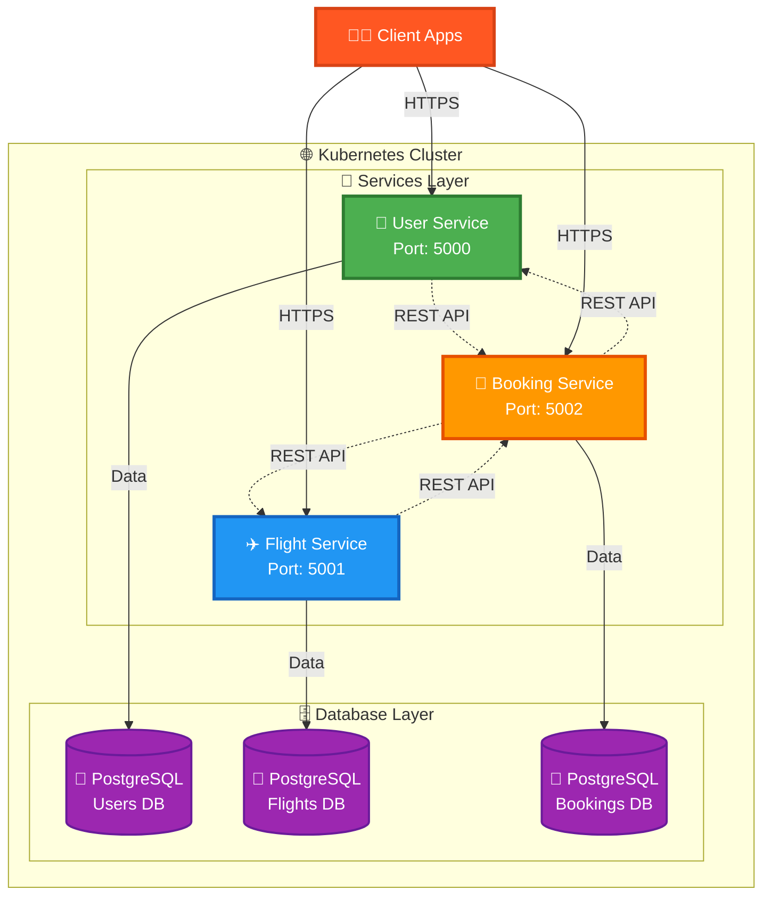

# ✈️ Airline Management Microservices 🚀

<div align="center">


### 🌟 A Cloud-Native Microservices Architecture for Modern Airline Operations 🌟


**[🎯 Features](#-features) • [🛠️ Tech Stack](#️-tech-stack) • [⚡ Quick Start](#-quick-start) • [📡 API Docs](#-api-endpoints) • [☸️ K8s Deploy](#️-kubernetes-deployment)**

---

</div>

## 🎭 Overview

<div align="center">
<table>
<tr>
<td width="33%" align="center">

<br/><b>🚀 Scalable</b><br/>Built for Growth
</td>
<td width="33%" align="center">

<br/><b>🔐 Secure</b><br/>JWT Authentication
</td>
<td width="33%" align="center">

<br/><b>⚙️ Automated</b><br/>K8s Orchestration
</td>
</tr>
</table>
</div>

The **Airline Management System** is a 🏆 **production-ready**, **cloud-native** microservices application engineered to handle airline operations at massive scale. Architected with **Kubernetes-first** principles, this system seamlessly manages user authentication, flight operations, and ticket bookings with enterprise-grade scalability and resilience.

### 💎 Key Highlights

<table>
<tr>
<td>

```diff
+ 🏗️ Microservices Architecture
  Independent, scalable services
  
+ ☸️ Kubernetes Native
  Built for container orchestration
  
+ 🔐 JWT Authentication
  Secure token-based auth
  
+ 🗄️ Database Per Service
  True microservices isolation
```

</td>
<td>

```diff
+ 📦 Fully Containerized
  Docker images for any cloud
  
+ 🔄 RESTful APIs
  Clean, documented endpoints
  
+ 🎯 Role-Based Access
  Admin & Customer roles
  
+ 🚀 Production Ready
  Tested and battle-hardened
```

</td>
</tr>
</table>

---

## ✨ Features

<details open>
<summary><h3>👤 User Service 🔑</h3></summary>

<br/>

| Feature | Description | Status |
|---------|-------------|--------|
| 📝 **User Registration** | Email validation & secure signup | ✅ Ready |
| 🔐 **JWT Authentication** | Token-based secure authentication | ✅ Ready |
| 👥 **Role Management** | Admin & Customer access control | ✅ Ready |
| 🔒 **Password Reset** | OTP-based secure password recovery | ✅ Ready |
| 📧 **Email Notifications** | Automated email for account activities | ✅ Ready |
| 🎫 **User Profile** | Complete profile management | ✅ Ready |

</details>

<details open>
<summary><h3>✈️ Flight Service 🌍</h3></summary>

<br/>

| Feature | Description | Status |
|---------|-------------|--------|
| 📝 **CRUD Operations** | Complete flight management (Admin) | ✅ Ready |
| 🔍 **Advanced Search** | Multi-parameter flight search | ✅ Ready |
| 📊 **Real-time Tracking** | Live availability updates | ✅ Ready |
| 🌐 **Multi-Route** | Support for complex routes | ✅ Ready |
| 📅 **Schedule Management** | Flexible scheduling system | ✅ Ready |
| 💺 **Seat Management** | Dynamic seat allocation | ✅ Ready |

</details>

<details open>
<summary><h3>🎫 Booking Service 💳</h3></summary>

<br/>

| Feature | Description | Status |
|---------|-------------|--------|
| 💺 **Smart Seat Allocation** | Intelligent seat assignment | ✅ Ready |
| 📖 **Booking History** | Complete transaction history | ✅ Ready |
| ✏️ **Modify Bookings** | Update existing reservations | ✅ Ready |
| ❌ **Easy Cancellation** | Quick refund processing | ✅ Ready |
| 🎟️ **Ticket Generation** | Automated ticket creation | ✅ Ready |
| 💰 **Payment Processing** | Secure payment handling | ✅ Ready |

</details>

---

## 🛠️ Tech Stack

<div align="center">

### 🎨 Backend Technologies


### 🗄️ Database & ORM


### 🐳 DevOps & Cloud


### 🧰 Development Tools


</div>

---

## 🏛️ Architecture

<div align="center">



</div>

### 🎯 Design Principles

- 🔄 **Loose Coupling**: Services communicate via REST APIs
- 🎪 **High Cohesion**: Each service owns its domain
- 📦 **Container-First**: Docker images for consistency
- ☸️ **K8s Native**: Designed for orchestration
- 🗄️ **Data Isolation**: Separate databases per service
- 🔐 **Security by Design**: JWT & role-based access

---

## ⚡ Quick Start

### 📋 Prerequisites Checklist

> ⚠️ Make sure you have these installed before proceeding!

<table>
<tr>
<td>

- ✅ **Node.js** v18+
- ✅ **npm** or **yarn**
- ✅ **PostgreSQL** v13+
- ✅ **Docker Desktop**

</td>
<td>

- ✅ **Docker Compose**
- ✅ **Kubernetes** (Minikube/K3s/Cloud)
- ✅ **kubectl** CLI
- ✅ **Git**

</td>
</tr>
</table>

### 🚀 Installation in 3 Steps

#### 1️⃣ Clone the Repository

```bash
# 📥 Clone the repo
git clone https://github.com/Vamshi-amudala/airline-management-microservices.git

# 📂 Navigate to directory
cd airline-management-microservices

# 🎉 You're ready to go!
```

#### 2️⃣ Setup Environment Variables

<details>
<summary>📝 Click to see environment configurations</summary>

**🔐 user-service/.env**
```env
# Server Configuration
PORT=5000
NODE_ENV=development

# 🗄️ Database Configuration
DB_HOST=postgres-user-service
DB_PORT=5432
DB_USER=postgres
DB_PASSWORD=yourStrongPassword123!
DB_NAME=airline_users

# 🔐 JWT Configuration
JWT_SECRET=your_super_secret_jwt_key_change_in_production
JWT_EXPIRY=24h

# 📧 Email Configuration
EMAIL_SERVICE=gmail
EMAIL_USER=your-email@gmail.com
EMAIL_PASS=your-app-password
EMAIL_FROM=Airline Management <noreply@airline.com>
```

**✈️ flight-service/.env**
```env
# Server Configuration
PORT=5001
NODE_ENV=development

# 🗄️ Database Configuration
DB_HOST=postgres-flight-service
DB_PORT=5432
DB_USER=postgres
DB_PASSWORD=yourStrongPassword123!
DB_NAME=airline_flights

# 🔐 JWT Configuration (for admin verification)
JWT_SECRET=your_super_secret_jwt_key_change_in_production
```

**🎫 booking-service/.env**
```env
# Server Configuration
PORT=5002
NODE_ENV=development

# 🗄️ Database Configuration
DB_HOST=postgres-booking-service
DB_PORT=5432
DB_USER=postgres
DB_PASSWORD=yourStrongPassword123!
DB_NAME=airline_bookings

# 🔐 JWT Configuration
JWT_SECRET=your_super_secret_jwt_key_change_in_production

# 🔗 Service URLs
USER_SERVICE_URL=http://user-service:5000
FLIGHT_SERVICE_URL=http://flight-service:5001
```

</details>

#### 3️⃣ Install Dependencies

```bash
# 📦 Install for all services
(cd user-service && npm install) && \
(cd flight-service && npm install) && \
(cd booking-service && npm install)

echo "✅ All dependencies installed successfully!"
```

### 🐳 Run with Docker Compose

```bash
# 🚀 Build and start all services
docker-compose up --build

# 🎉 Services will be available at:
# 👤 User Service:    http://localhost:5000
# ✈️ Flight Service:  http://localhost:5001
# 🎫 Booking Service: http://localhost:5002
```

---

## ☸️ Kubernetes Deployment

### 🎯 Deploy to Production

<div align="center">

```ascii
┌─────────────────────────────────────────┐
│  🎯 Kubernetes Deployment Pipeline      │
├─────────────────────────────────────────┤
│  1. Create Secrets & ConfigMaps    🔐   │
│  2. Deploy PostgreSQL Instances    🗄️   │
│  3. Deploy Microservices           🚀   │
│  4. Verify & Monitor               ✅   │
└─────────────────────────────────────────┘
```

</div>

#### 1️⃣ Create Secrets and ConfigMaps

```bash
# 🔐 Create database credentials secret
kubectl create secret generic db-credentials \
  --from-literal=DB_USER=postgres \
  --from-literal=DB_PASSWORD=yourStrongPassword123!

# 🔑 Create JWT secret
kubectl create secret generic jwt-secret \
  --from-literal=JWT_SECRET=your_super_secret_jwt_key_change_in_production

# 📧 Create email credentials secret
kubectl create secret generic email-credentials \
  --from-literal=EMAIL_USER=your-email@gmail.com \
  --from-literal=EMAIL_PASS=your-app-password

# ✅ Verify secrets
kubectl get secrets
```

#### 2️⃣ Deploy PostgreSQL Databases

```bash
# 🗄️ Deploy all PostgreSQL instances
kubectl apply -f k8s/postgres-deployments.yaml

# ⏳ Wait for databases to be ready
kubectl wait --for=condition=ready pod -l app=postgres --timeout=300s

# ✅ Check database pods
kubectl get pods -l app=postgres
```

#### 3️⃣ Deploy Microservices

```bash
# 🚀 Deploy all services
kubectl apply -f k8s/user-service-deployment.yaml
kubectl apply -f k8s/flight-service-deployment.yaml
kubectl apply -f k8s/booking-service-deployment.yaml

# 🎉 All services deployed!
```

#### 4️⃣ Verify Deployment

```bash
# 📊 Check all pods
kubectl get pods --watch

# 🌐 Check all services
kubectl get svc

# 📋 Check deployment status
kubectl get deployments

# 🔍 View logs for a specific service
kubectl logs -f deployment/user-service
kubectl logs -f deployment/flight-service
kubectl logs -f deployment/booking-service
```

#### 5️⃣ Access Services

```bash
# 🌐 Port forward to access locally
kubectl port-forward service/user-service 5000:5000 &
kubectl port-forward service/flight-service 5001:5001 &
kubectl port-forward service/booking-service 5002:5002 &

echo "✅ Services accessible at:"
echo "👤 User Service:    http://localhost:5000"
echo "✈️ Flight Service:  http://localhost:5001"
echo "🎫 Booking Service: http://localhost:5002"
```

### 📊 Monitoring Commands

```bash
# 💓 Health check
kubectl get componentstatuses

# 📈 Resource usage
kubectl top pods
kubectl top nodes

# 🔄 Restart a deployment
kubectl rollout restart deployment/user-service

# 🔙 Rollback a deployment
kubectl rollout undo deployment/user-service

# 🗑️ Delete all resources
kubectl delete all --all
```

---

## 📡 API Endpoints

### 👤 User Service API

<div align="center">

| 🎯 Method | 🔗 Endpoint | 📝 Description | 🔐 Auth | 📊 Status |
|-----------|-------------|----------------|---------|-----------|
| **POST** | `/api/v1/users/register` | Register new user | ❌ No | ✅ |
| **POST** | `/api/v1/users/login` | User login & get JWT | ❌ No | ✅ |
| **GET** | `/api/v1/users/profile` | Get user profile | ✅ Yes | ✅ |
| **PUT** | `/api/v1/users/profile` | Update profile | ✅ Yes | ✅ |
| **POST** | `/api/v1/users/reset-password` | Request password reset | ❌ No | ✅ |
| **PUT** | `/api/v1/users/reset-password/verify` | Verify OTP & reset | ❌ No | ✅ |
| **GET** | `/api/v1/users/health` | Service health check | ❌ No | ✅ |

</div>

<details>
<summary>📝 <b>Click for Example Requests</b></summary>

**Register User:**
```bash
curl -X POST http://localhost:5000/api/v1/users/register \
  -H "Content-Type: application/json" \
  -d '{
    "name": "John Doe",
    "email": "john@example.com",
    "password": "SecurePass123!",
    "phone": "+1234567890"
  }'
```

**Login:**
```bash
curl -X POST http://localhost:5000/api/v1/users/login \
  -H "Content-Type: application/json" \
  -d '{
    "email": "john@example.com",
    "password": "SecurePass123!"
  }'
```

</details>

---

### ✈️ Flight Service API

<div align="center">

| 🎯 Method | 🔗 Endpoint | 📝 Description | 🔐 Auth | 👤 Role |
|-----------|-------------|----------------|---------|---------|
| **GET** | `/api/v1/flights` | Get all flights | ❌ No | Public |
| **GET** | `/api/v1/flights/search` | Search flights | ❌ No | Public |
| **GET** | `/api/v1/flights/:id` | Get flight by ID | ❌ No | Public |
| **POST** | `/api/v1/flights` | Create new flight | ✅ Yes | 👑 Admin |
| **PUT** | `/api/v1/flights/:id` | Update flight | ✅ Yes | 👑 Admin |
| **DELETE** | `/api/v1/flights/:id` | Delete flight | ✅ Yes | 👑 Admin |
| **GET** | `/api/v1/flights/health` | Service health | ❌ No | Public |

</div>

<details>
<summary>📝 <b>Click for Example Requests</b></summary>

**Search Flights:**
```bash
curl -X GET "http://localhost:5001/api/v1/flights/search?from=NYC&to=LAX&date=2025-12-25"
```

**Create Flight (Admin):**
```bash
curl -X POST http://localhost:5001/api/v1/flights \
  -H "Content-Type: application/json" \
  -H "Authorization: Bearer YOUR_JWT_TOKEN" \
  -d '{
    "flightNumber": "AA123",
    "from": "NYC",
    "to": "LAX",
    "departureTime": "2025-12-25T10:00:00Z",
    "arrivalTime": "2025-12-25T13:00:00Z",
    "price": 299.99,
    "totalSeats": 180,
    "availableSeats": 180
  }'
```

</details>

---

### 🎫 Booking Service API

<div align="center">

| 🎯 Method | 🔗 Endpoint | 📝 Description | 🔐 Auth | 📊 Status |
|-----------|-------------|----------------|---------|-----------|
| **POST** | `/api/v1/bookings` | Create new booking | ✅ Yes | ✅ |
| **GET** | `/api/v1/bookings/user/:userId` | Get user bookings | ✅ Yes | ✅ |
| **GET** | `/api/v1/bookings/:id` | Get booking details | ✅ Yes | ✅ |
| **PUT** | `/api/v1/bookings/:id` | Update booking | ✅ Yes | ✅ |
| **DELETE** | `/api/v1/bookings/:id/cancel` | Cancel booking | ✅ Yes | ✅ |
| **GET** | `/api/v1/bookings/health` | Service health | ❌ No | ✅ |

</div>

<details>
<summary>📝 <b>Click for Example Requests</b></summary>

**Create Booking:**
```bash
curl -X POST http://localhost:5002/api/v1/bookings \
  -H "Content-Type: application/json" \
  -H "Authorization: Bearer YOUR_JWT_TOKEN" \
  -d '{
    "flightId": "flight-uuid",
    "userId": "user-uuid",
    "passengers": [
      {
        "name": "John Doe",
        "age": 30,
        "seatNumber": "12A"
      }
    ],
    "totalAmount": 299.99
  }'
```

**Get User Bookings:**
```bash
curl -X GET http://localhost:5002/api/v1/bookings/user/USER_UUID \
  -H "Authorization: Bearer YOUR_JWT_TOKEN"
```

</details>

---

## 📁 Project Structure

```
airline-management-microservices/
│
├── 👤 user-service/
│   ├── 📂 src/
│   │   ├── 🎮 controllers/      # Request handlers
│   │   ├── 📊 models/           # Sequelize models
│   │   ├── 🛣️ routes/           # API routes
│   │   ├── 🔒 middleware/       # Auth & validation
│   │   ├── 🛠️ utils/            # Helper functions
│   │   ├── ⚙️ config/           # Configuration files
│   │   └── 📄 app.js            # Express app setup
│   ├── 🐳 Dockerfile
│   ├── 📦 package.json
│   └── 🔧 .env.example
│
├── ✈️ flight-service/
│   ├── 📂 src/
│   │   ├── 🎮 controllers/
│   │   ├── 📊 models/
│   │   ├── 🛣️ routes/
│   │   ├── 🔒 middleware/
│   │   ├── 🛠️ utils/
│   │   ├── ⚙️ config/
│   │   └── 📄 app.js
│   ├── 🐳 Dockerfile
│   ├── 📦 package.json
│   └── 🔧 .env.example
│
├── 🎫 booking-service/
│   ├── 📂 src/
│   │   ├── 🎮 controllers/
│   │   ├── 📊 models/
│   │   ├── 🛣️ routes/
│   │   ├── 🔒 middleware/
│   │   ├── 🛠️ utils/
│   │   ├── ⚙️ config/
│   │   └── 📄 app.js
│   ├── 🐳 Dockerfile
│   ├── 📦 package.json
│   └── 🔧 .env.example
│
├── ☸️ k8s/                      # Kubernetes manifests
│   ├── 📄 user-service-deployment.yaml
│   ├── 📄 user-service-service.yaml
│   ├── 📄 flight-service-deployment.yaml
│   ├── 📄 flight-service-service.yaml
│   ├── 📄 booking-service-deployment.yaml
│   ├── 📄 booking-service-service.yaml
│   ├── 📄 postgres-deployments.yaml
│   ├── 📄 postgres-services.yaml
│   ├── 🔐 secrets.yaml
│   ├── ⚙️ configmaps.yaml
│   └── 📊 ingress.yaml
│
├── 🐳 docker-compose.yml        # Local development
├── 📚 README.md                 # This file!
├── 📋 .gitignore
└── 📜 LICENSE
```

---

## 🔮 Future Enhancements

<div align="center">

### 🚀 Roadmap 2025

</div>

<table>
<tr>
<td width="50%">

#### 🎯 Phase 1: Core Features
- [x] ✅ Microservices architecture
- [x] ✅ JWT authentication
- [x] ✅ Database per service
- [x] ✅ Kubernetes deployment
- [ ] 🔴 Real-time seat selection (WebSockets)
- [ ] ⚡ Redis caching layer
- [ ] 📧 Advanced notification system

</td>
<td width="50%">

#### 🎨 Phase 2: UI & Experience
- [ ] 📱 React Native mobile app
- [ ] 🌐 Admin dashboard (React)
- [ ] 🎨 Customer portal
- [ ] 🗺️ Multi-language support
- [ ] 🌙 Dark mode
- [ ] ♿ Accessibility features
- [ ] 🎭 Progressive Web App

</td>
</tr>
<tr>
<td width="50%">

#### 🔧 Phase 3: DevOps & Monitoring
- [ ] 📊 Prometheus & Grafana
- [ ] 📈 ELK Stack logging
- [ ] 🔄 CI/CD with GitHub Actions
- [ ] 📦 Helm charts
- [ ] 🧪 Integration tests
- [ ] 🔒 Security scanning
- [ ] 🌍 Multi-region deployment

</td>
<td width="50%">

#### 💎 Phase 4: Advanced Features
- [ ] 💳 Payment gateway integration
- [ ] 🤖 AI-powered recommendations
- [ ] 📊 Analytics & reporting
- [ ] 💰 Dynamic pricing
- [ ] 🎁 Loyalty program
- [ ] 📸 Baggage tracking
- [ ] ✈️ Flight status notifications

</td>
</tr>
</table>

---

## 🤝 Contributing

<div align="center">

### 🌟 We Love Contributors! 🌟


</div>

Contributions are **greatly appreciated**! Here's how you can help:

1. 🍴 **Fork** the repository
2. 🌱 Create your feature branch
   ```bash
   git checkout -b feature/AmazingFeature
   ```
3. 💾 Commit your changes
   ```bash
   git commit -m '✨ Add some AmazingFeature'
   ```
4. 📤 Push to the branch
   ```bash
   git push origin feature/AmazingFeature
   ```
5. 🎉 Open a **Pull Request**

### 📜 Contribution Guidelines

- ✅ Follow the existing code style
- ✅ Write meaningful commit messages
- ✅ Add tests for new features
- ✅ Update documentation
- ✅ Be respectful and collaborative

---

## 📄 License

<div align="center">

This project is licensed under the **MIT License**

See the [LICENSE](LICENSE) file for details

[](https://opensource.org/licenses/MIT)

</div>

---

## 👨‍💻 Author

<div align="center">

### 🚀 **Vamshi Amudala** 🚀

[](https://github.com/Vamshi-amudala)
[![LinkedIn](https://
